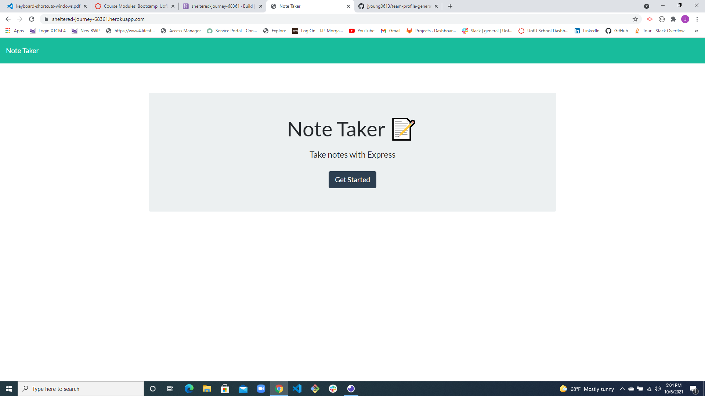
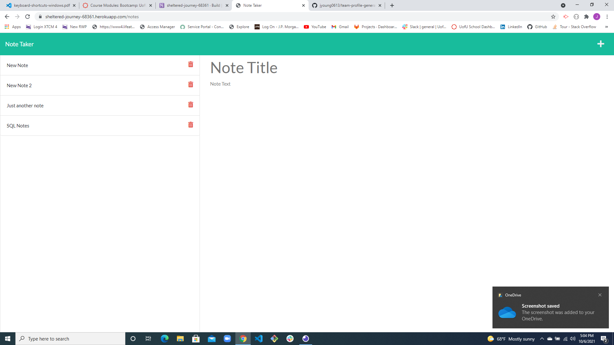
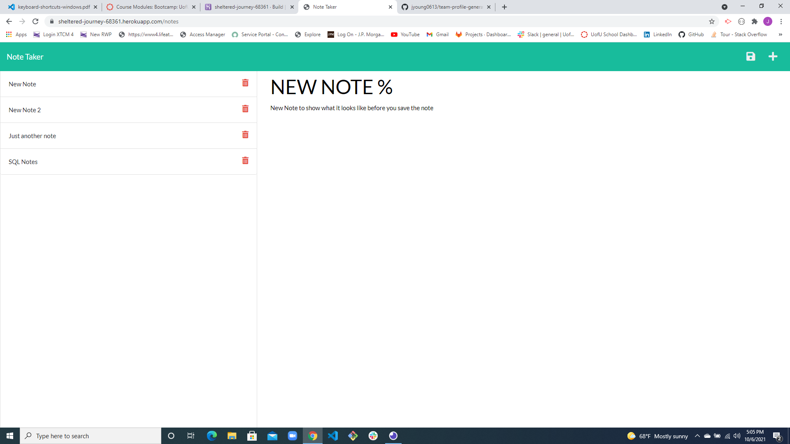
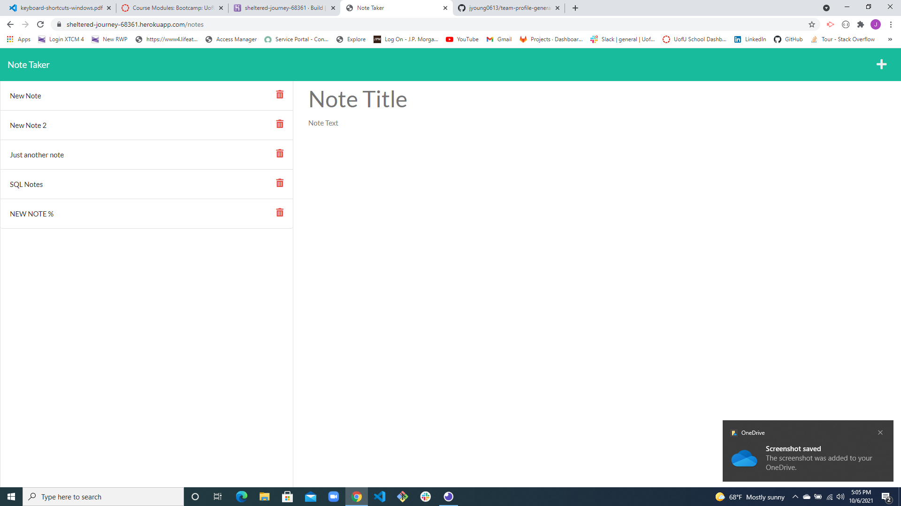

# note-takr

  

  ## Description
  font and back end application using express to assist user with generating notes

  ## Table of Contents
  - [Installation](#Installation)
  - [Usage](#Usage)
  - [Contributing](#Contributing)
  - [Tests](#Tests)
  - [License](#License)
  - [Questions](#Questions)

  ## Installation
  The site is live on the web https://sheltered-journey-68361.herokuapp.com/ 

  ## Usage
  This is a note taking application.  Its so you can take any necessary notes with a title and description along with the ability to save and delete notes.

  
  
  
  

  ## Contributing
  Node built program using js express package to allow client to add notes with a title and description.

  ## Tests
  * Clone repo code from GitHub 
  * Make sure you have Node.js downloaded on your machine 
  * Run npm i from command line at the root folder of the readme-generator 
  * Then type node index.js to initiate the program to ask the necessary questions in the terminal
  * Run npm install (npm i) from command line at the root folder of the cloned note-takr repo to install all dependencies
  * type npm start in command line to see the code displayed to the web via your local host address (http://localhost:PORT) combined with the port you choose to use.
  * All functionality can also be tested by going to my live site https://sheltered-journey-68361.herokuapp.com/
  * Run npm install (npm i) from command line at the root folder of the cloned note-takr repo to install all dependencies
  * type npm start in command line to see the code displayed to the web via your local host address (http://localhost:PORT) combined with the port you choose to use.
  * All functionality can also be tested by going to my live site https://sheltered-journey-68361.herokuapp.com/

  ## License
  This project is licensed under the terms of the following license: **MIT**.

  ## Questions
  GitHub: [jyoung0613](https://github.com/jyoung0613).  

  For inquiries, please contact jwyoung0613@gmail.com.
